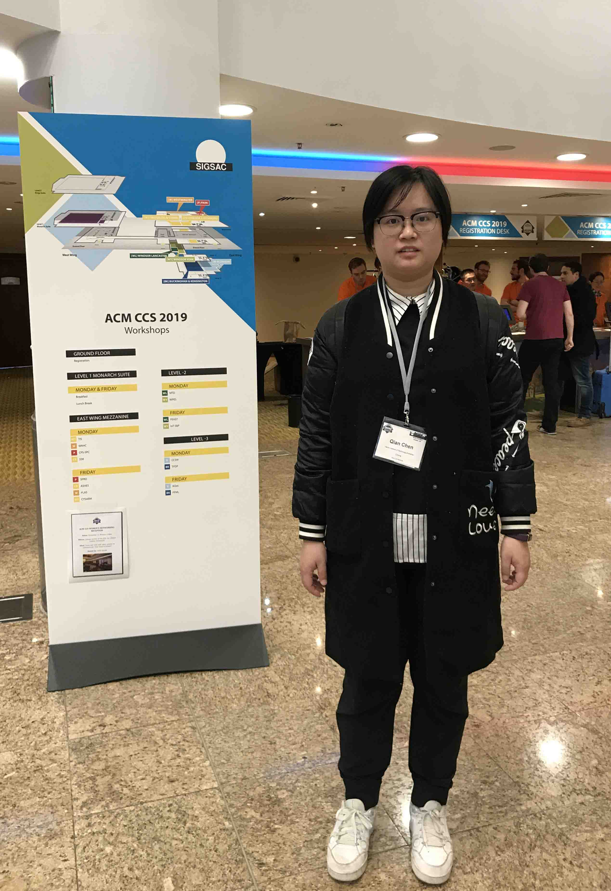

<div>
<table border="0">
  <tr>
    <td>
      <h1>Qian Chen</h1>
      <p><b>PhD Candidate</b></p>
      <p><a href="http://carc.hitsz.edu.cn">CARC Laboratory</a><br/><a href="http://cs.hitsz.edu.cn/">Department of Computer Science and Technology</a><br/><a href="http://www.hitsz.edu.cn/">Harbin Institute of Technology, Shenzhen</a></p>
      <p><b>计算机应用研究中心，计算机科学与技术学院，<br/>哈尔滨工业大学（深圳）</b></p>
      <p><b>E-mail：qianchen@stu.hit.edu.cn</b></p>
      <p><b>Address：University Town of Shenzhen, Nanshan District, Shenzhen, Guangdong, China</b></p>
    </td>
    <td  width="30%" >
      
    </td>
  </tr>
</table>
</div>


# Welcome to GitHub Pages

You can use the [editor on GitHub](https://github.com/QianChen-CQ/QianChen-CQ.github.io/edit/master/README.md) to maintain and preview the content for your website in Markdown files.

Whenever you commit to this repository, GitHub Pages will run [Jekyll](https://jekyllrb.com/) to rebuild the pages in your site, from the content in your Markdown files.


## Research Interests:

- Privacy-Preserving(隐私保护), 
- Cryptography(密码学),
- Federal Learning(联邦学习), 
- Deep Learning(深度学习)


### Markdown

Markdown is a lightweight and easy-to-use syntax for styling your writing. It includes conventions for

```markdown
Syntax highlighted code block

# Header 1
## Header 2
### Header 3

- Bulleted
- List

1. Numbered
2. List

**Bold** and _Italic_ and `Code` text

[Link](url) and 
```

For more details see [GitHub Flavored Markdown](https://guides.github.com/features/mastering-markdown/).

### Jekyll Themes

Your Pages site will use the layout and styles from the Jekyll theme you have selected in your [repository settings](https://github.com/QianChen-CQ/QianChen-CQ.github.io/settings). The name of this theme is saved in the Jekyll `_config.yml` configuration file.

### Support or Contact

Having trouble with Pages? Check out our [documentation](https://help.github.com/categories/github-pages-basics/) or [contact support](https://github.com/contact) and we’ll help you sort it out.
